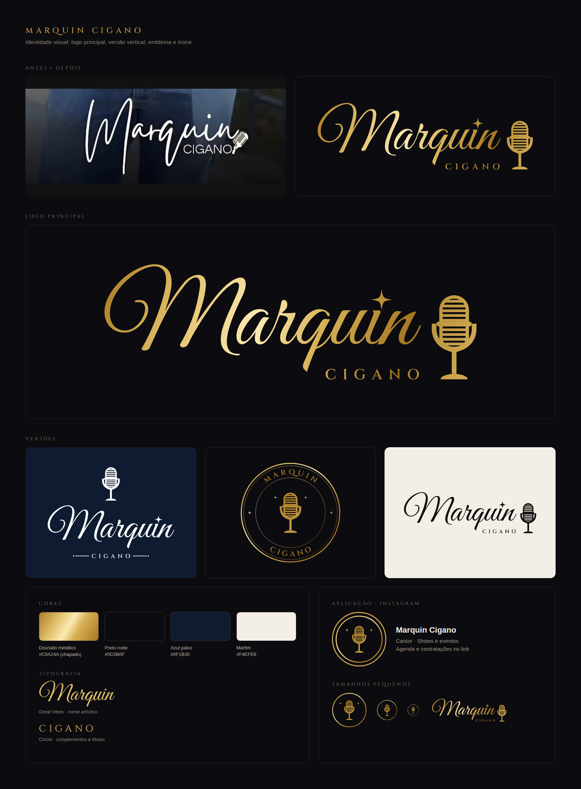

# Marquin Cigano · Logo



Redesenho do logo do cantor Marquin Cigano. A estrutura do logo antigo continua a mesma (nome em letra cursiva, "CIGANO" embaixo e microfone ao lado), só que com acabamento profissional:

- **Nome** em Great Vibes, uma cursiva elegante que continua legível em tamanhos pequenos.
- **Pingo do "i"** trocado por uma estrela, o toque de brilho do palco.
- **"CIGANO"** em Cinzel (letras romanas espaçadas), alinhado ao fim do nome.
- **Microfone retrô** desenhado em vetor, traço limpo e reconhecível mesmo pequeno.
- **Paleta dourada** sobre preto, com versões em branco, preto e dourado chapado.

## Versões

| Arquivo | Quando usar |
|---|---|
| `principal` | Uso padrão: banners, capas, cartazes, assinatura de vídeo |
| `vertical` | Espaços quadrados ou altos: stories, flyers, camisetas |
| `emblema` | Selo redondo: foto de perfil, adesivo, bumbo da bateria, carimbo |
| `icone` | Tamanhos muito pequenos: favicon, marca d'água, avatar |

Cada versão tem 4 cores:

| Cor | Fundo indicado |
|---|---|
| `dourado` (degradê metálico) | Preto ou fundos escuros (versão principal da marca) |
| `dourado-chapado` (#C9A24A) | Impressão em uma cor, bordado, silk, gravação |
| `branco` | Fotos escuras, azul (#0F1B30), vídeos |
| `preto` | Fundos claros, documentos, contratos |

## Arquivos

- `svg/`: vetores, para gráfica, bordado, editar no Canva/Illustrator/Corel. Os textos já estão em curvas, então abrem certo em qualquer computador, mesmo sem as fontes instaladas.
- `png/`: fundo transparente, alta resolução (principal 3000 px, vertical 2400 px, emblema 2000 px, ícone 1024 px). Bom para redes sociais e para mandar pelo WhatsApp.
- `fontes/`: Great Vibes e Cinzel (licença livre OFL), para usar nas artes de divulgação e manter a identidade.
- `gerador/`: scripts que geram os logos (só é preciso para alterar o desenho).

## Cores

| Nome | Hex |
|---|---|
| Dourado (chapado) | `#C9A24A` |
| Degradê dourado | `#A87A22` → `#E3C26E` → `#FBEAB2` → `#D8B257` → `#A57620` |
| Preto noite | `#0C0B0F` |
| Azul palco | `#0F1B30` |
| Marfim | `#F4EFE6` |

## Regras de uso

- Deixe um respiro em volta do logo de pelo menos a altura do microfone.
- Não distorça (sempre redimensione proporcionalmente), não troque as fontes e não aplique sombra ou contorno.
- Em fotos com muita informação, use a versão `branco` ou aplique o logo sobre uma faixa escura.
- Abaixo de ~150 px de largura, prefira o `icone` em vez do emblema (o texto do emblema fica pequeno demais).

## Como regerar

```bash
pip install fonttools uharfbuzz
cd gerador
python3 gerar_logos.py        # escreve os SVGs em ../svg
npm i playwright && node exportar_png.js   # exporta os PNGs em ../png
```
